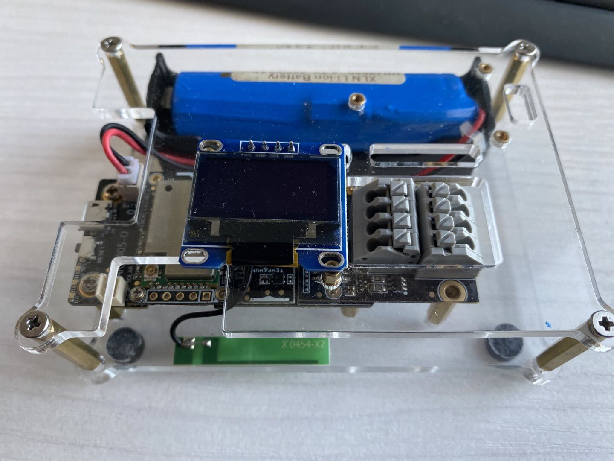

# RAKwireless WisBlock
#### 
## Introduction
Wisblock is an amazing product built by the RAK company for IoT industry. It can build circuits like clicking blocks together to quickly to realize your idea.

WisBlock consists of WisBase board, WisCore board, WisSensor board and WisIO board.
- WisBase → the block that the whole system is build on.    
- WisCore → the processing unit with the microcontroller    
- WisSensor → the blocks with a variety of sensors    
- WisIO → The blocks that extend the communication possibilities of the WisBlock.

This repository is created to make your start with WisBlock as simple as possible.
Let's get started.

----
## Where to find what

Document List

- [Quick Start Guide]((https://bitbucket.org/Fomi-RAK/wisblock-rak4630-development/src/master/doc/Quick_Start/))
- [Bootloader](https://bitbucket.org/Fomi-RAK/wisblock-rak4630-development/src/master/bootloader/)
- [Examples](https://bitbucket.org/Fomi-RAK/wisblock-rak4630-development/src/master/examples/)
    - [Communications](https://bitbucket.org/Fomi-RAK/wisblock-rak4630-development/src/master/examples/communications/)
        - [LoRa](https://bitbucket.org/Fomi-RAK/wisblock-rak4630-development/src/master/examples/communications/LoRa/)
           - [LoRaWAN](https://bitbucket.org/Fomi-RAK/wisblock-rak4630-development/src/master/examples/communications/LoRa/LoRaWAN/)
           - [LoRaP2P](https://bitbucket.org/Fomi-RAK/wisblock-rak4630-development/src/master/examples/communications/LoRa/LoRaP2P/)

        - [BLE](https://bitbucket.org/Fomi-RAK/wisblock-rak4630-development/src/master/examples/communications/BLE/)
            - [BLE_Gateway](https://bitbucket.org/Fomi-RAK/wisblock-rak4630-development/src/master/examples/communications/BLE/ble_gateway/)
            - [BLE Proximity Sensing](https://bitbucket.org/Fomi-RAK/wisblock-rak4630-development/src/master/examples/communications/BLE/ble_proximity_sensing/)
        - [WiFi](https://bitbucket.org/Fomi-RAK/wisblock-rak4630-development/src/master/examples/communications/WiFi/)
    - [Sensors](https://bitbucket.org/Fomi-RAK/wisblock-rak4630-development/src/master/examples/sensors/)
        - [Accelerate](https://bitbucket.org/Fomi-RAK/wisblock-rak4630-development/src/master/examples/sensors/accelerate_lis3dh/)
        - [GPS](https://bitbucket.org/Fomi-RAK/wisblock-rak4630-development/src/master/examples/sensors/gps_ublox7/)
    - [Solutions](https://bitbucket.org/Fomi-RAK/wisblock-rak4630-development/src/master/examples/solutions/)

## Overview
WisBlock is a modular Plug&Play system. Compared with other systems (Arduino, Raspberry Pi, M5Stack) it has several advantages.

1. Using a compact connector makes its size very small. A WisBase board, which is the base carrier, is only 30mm by 60mm in size. One WisBase can hold one microcontroller module (WisCore), one IO module (WisIO) and up to 4 sensor modules (WisSensor).

2. Using an industrial rated connector enables you to use the same modules from rapid prototyping to testing to final product.  

3. WisBlock is not only modular on hardware base, but with ready to use software blocks it is simple to create an application to match your implementation requirements.

----
## Modularity
### Base board
WisBase is the base board that makes flexibility and modularity possible.

### Plug&Play hardware modules 
WisCore → processing blocks with LoRa/LoRaWan connectivity    
WisSensor → wide range of sensor blocks    
WisIO → blocks for user interfaces, custom sensor connections and actuators   

### Plug&Play software modules
Using Arduino framework provides a free and widely available programming environment
Open Source libraries for communication protocols
Open Source libraries for data processing
Open Source libraries for sensors input
Open Source libraries for actuators
Open Source libraries for user interfaces

----
### WisBase
WisBlock is build up on a WisBase, a platform carrier that allows easy plug-in of 1 WisDuo processing board, 1 WisIO interface board and up to 4 WisSensor boards.

WisBase is providing the power supply, battery and solar panel supplies and charging block. In addition it has connectors for programming and debugging. 

During development phase WisBase allows you to quickly switch between microcontrollers, IO functionality and sensors by simply changing the modules.

Repairs and upgrades are easy with WisBase on your final product, because modules can be changed with just Plug'n'Play.

For controlling and limiting power consumption of your IoT solution, WisBase enables to control the power supply for the WisSensor and WisIO modules, limiting the power consumption by switching off these modules if they are not needed.

----
### WisCore
WisCore is the processing unit of your IoT solution.

Select the processing power based on the requirements of your application from a range of processing boards which starts with low single core to high dual core processing power  units are available. 

All of them have the LoRa/LoRaWan communication capability, some of them offer in addition WiFi, Bluetooth or Bluetooth Low Energy. All are designed for battery optimized low power consumption.

----
### WisSensor
A range of sensors for sensing environmental conditions (temperature, humidity, …), location and movement conditions (GNSS/GPS, accelerometer, …) that you just plug into WisBase makes it easy to complete your application with the required sensors.

----
### WisIO
WisIO extensions provide your application with interfaces that are not covered by WisDuo or WisSensor blocks.     
This includes 
- user interfaces like 
  - keyboards
  - buttons
  - displays
- communication interfaces like    
  - 0~5V
  - 4-20mA
  - I2C
  - RS232
  - RS485
  - many more
- alternative power supplies like
  - 24V
  - POE
